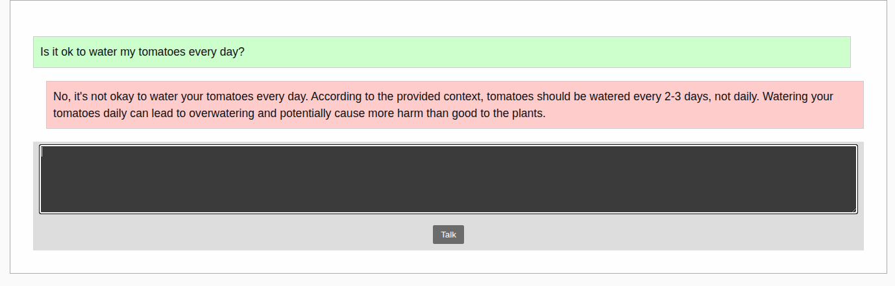

# RAG example project

This project is a [Retrieval-Autmented Generation](https://en.wikipedia.org/wiki/Retrieval-augmented_generation) system
that runs locally, thanks to several projects:

- [Micronaut](#micronaut-482-documentation)
- [LangChain4J](https://docs.langchain4j.dev/)
- [Jlama](https://github.com/tjake/Jlama)

## How to run

Use the standard micronaut command to run the server:

```shell
mvn mn:run
```

Once the system is up, visit this url with your browser: `http://localhost:8080`, and use the text box to type in any
question:


## Micronaut 4.8.2 Documentation

- [User Guide](https://docs.micronaut.io/4.8.2/guide/index.html)
- [API Reference](https://docs.micronaut.io/4.8.2/api/index.html)
- [Configuration Reference](https://docs.micronaut.io/4.8.2/guide/configurationreference.html)
- [Micronaut Guides](https://guides.micronaut.io/index.html)

---

- [Micronaut Maven Plugin documentation](https://micronaut-projects.github.io/micronaut-maven-plugin/latest/)

## Feature micronaut-aot documentation

- [Micronaut AOT documentation](https://micronaut-projects.github.io/micronaut-aot/latest/guide/)

## Feature maven-enforcer-plugin documentation

- [https://maven.apache.org/enforcer/maven-enforcer-plugin/](https://maven.apache.org/enforcer/maven-enforcer-plugin/)

## Feature serialization-jackson documentation

- [Micronaut Serialization Jackson Core documentation](https://micronaut-projects.github.io/micronaut-serialization/latest/guide/)


